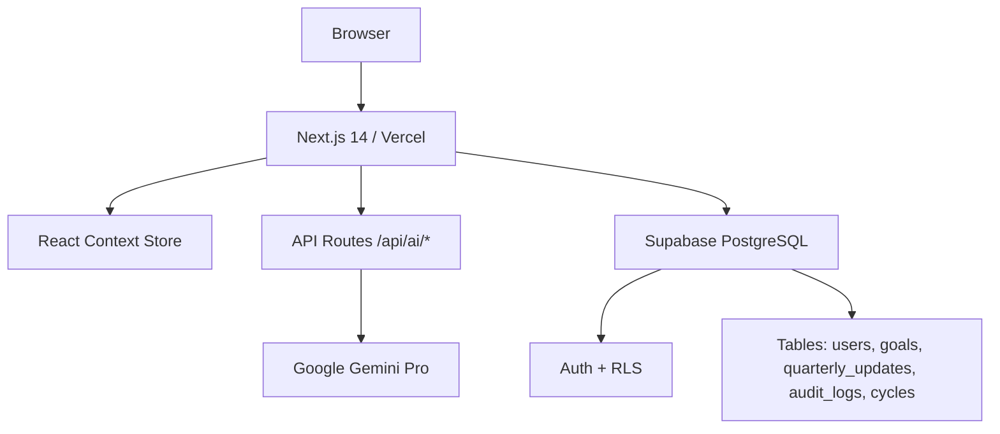

<<<<<<< HEAD
# AlignIQ — AI-Assisted Goal Setting & KPI Tracking Portal

> Enterprise-grade performance management system built with Next.js 14, Supabase, and Gemini AI.

---

## Quick Start (Zero Config — Demo Mode)

No Supabase or Gemini key needed. Runs fully in-memory with realistic seed data.

```bash
# 1. Install dependencies
npm install

# 2. Start dev server
npm run dev

# 3. Open
open http://localhost:3000
```

Switch roles instantly in the sidebar (Employee / Manager / Admin).

---

## Full Setup with Supabase

### 1. Create Supabase project
https://app.supabase.com → New Project

### 2. Run the schema
SQL Editor → paste `supabase/schema.sql` → Run

### 3. Get API keys
Project Settings → API → copy URL + anon key + service_role key

### 4. Configure environment
```bash
cp .env.example .env.local
# Fill in your values
```

---

## Gemini AI Setup

```bash
# 1. Get API key
# https://aistudio.google.com/app/apikey

# 2. Add to .env.local
GEMINI_API_KEY=your-key-here
```

Without a key, all AI features show realistic demo responses.

---

## Environment Variables

| Variable | Required | Description |
|----------|----------|-------------|
| `NEXT_PUBLIC_SUPABASE_URL` | For DB | Supabase project URL |
| `NEXT_PUBLIC_SUPABASE_ANON_KEY` | For DB | Supabase anon key |
| `SUPABASE_SERVICE_ROLE_KEY` | For DB | Supabase service role key |
| `GEMINI_API_KEY` | For AI | Google Gemini Pro API key |

---

## Demo Accounts (Sidebar Role Switcher)

| Name | Role | Notes |
|------|------|-------|
| Priya Sharma | Employee | 4 approved goals, Q1-Q4 check-ins |
| Rahul Menon | Employee | 4 goals (1 submitted, 1 draft) |
| Deepa Iyer | Manager | Manages Priya & Rahul |
| Kiran Patel | Admin / HR | Full org access |

---

## Project Structure

```
src/
├── app/
│   ├── dashboard/          # All pages (goals, approvals, checkin, analytics, admin, audit, reports)
│   └── api/ai/             # Gemini AI routes (smart, kpi, summary)
├── components/
│   ├── ui/                 # Badge, Button, Card, Modal, Input, ProgressBar, etc.
│   ├── layout/             # Sidebar, Header, ToastContainer
│   ├── goals/              # GoalCard, GoalFormModal, ApprovalModal, CheckInModal, AIPanel
│   └── analytics/          # LineSpark, DonutChart, HorizontalBar, ProgressHeatmap
└── lib/
    ├── store.tsx            # Global state (AppProvider + selectors)
    ├── constants.ts         # Seed data, enums
    ├── progress.ts          # Min/Max/Timeline/Zero engine
    ├── ai.ts                # Gemini API client
    └── supabase.ts          # Supabase client
```

---

## Progress Calculation Engine

```
Min      → progress = (target / achievement) × 100   [lower = better]
Max      → progress = (achievement / target) × 100   [higher = better]
Timeline → actual ≤ deadline → 100%; penalised by days overdue
Zero     → achievement == 0 → 100%; else → 0%
```

---

## Business Rules Enforced

- Max 8 goals per employee
- Min 10% weightage per goal
- Total weightage must equal 100%
- Goals lock after manager approval
- Locked goals cannot be edited (Admin can unlock)
- Check-in windows configurable by Admin
- Role-based access: Employee / Manager / Admin

---

## Deployment to Vercel

```bash
# 1. Push to GitHub
git init && git add . && git commit -m "AlignIQ MVP"
git remote add origin https://github.com/your-org/aligniq.git
git push -u origin main

# 2. Import at https://vercel.com/new
# 3. Add env vars
# 4. Deploy
```

---

## Scripts

```bash
npm run dev      # Development server (localhost:3000)
npm run build    # Production build
npm run start    # Start production server
npx tsc --noEmit # Type check
```

---

## Architecture Diagram



---

## Features

| Module | Status |
|--------|--------|
| Employee Goal Sheet (CRUD + validation) | ✅ |
| Manager Approval Workflow | ✅ |
| Quarterly Check-Ins (Q1–Q4) | ✅ |
| Progress Engine (Min/Max/Timeline/Zero) | ✅ |
| Role-Based Dashboards (3 roles) | ✅ |
| Analytics (trend, heatmap, donut, bars) | ✅ |
| Admin Panel (cycles, escalations, unlock) | ✅ |
| Audit Trail (searchable) | ✅ |
| Reports & CSV Export | ✅ |
| AI: SMART Goal Enhancer | ✅ |
| AI: KPI Suggestion Generator | ✅ |
| AI: Performance Summary | ✅ |
| Toast Notifications | ✅ |
| Dark Mode UI | ✅ |
| Zero-config demo mode | ✅ |
=======
# aligniq
>>>>>>> 58e31be1bf9385c8978dcedbcf1158b01c47f88c
